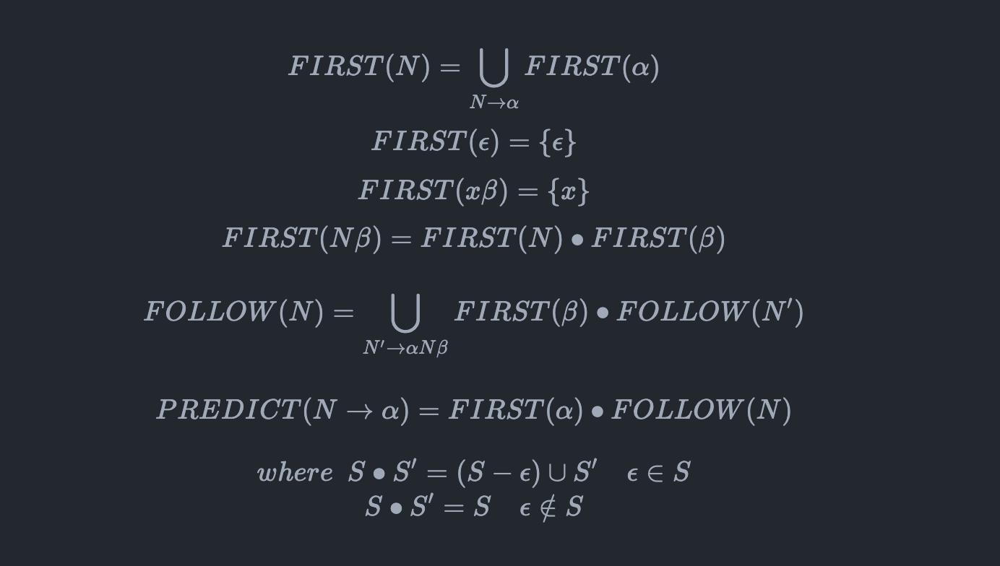

## Generate FIRST/FOLLOW/PREDICT Set from BNF.
We can use it to study parser theory. The generate [rule](#rule) is from [\<Language Implementation Patterns\>](https://pragprog.com/titles/tpdsl/language-implementation-patterns/)

[](https://goreportcard.com/report/github.com/tutumagi/grammar)
[](https://codecov.io/gh/tutumagi/grammar)

### Feature
* [x] FirstSet generate.
* [x] FollowSet generate.
* [x] LL(1) Predicate Parsing Table generate.

### Usage
#### You can use demo input to generate FirstSet/FollowSet/PredictTable

```sh
cd cmd
go run main.go
```

<details>
  <summary>Output to the terminal default</summary>

   ```
   FirstSet:
FIRST(D) = {g ε f}
FIRST(E) = {g ε}
FIRST(F) = {f ε}
FIRST(S) = {a}
FIRST(B) = {c}
FIRST(C) = {b ε}

FollowSet:
FOLLOW(F) = {h}
FOLLOW(S) = {$}
FOLLOW(B) = {g h f}
FOLLOW(C) = {g h f}
FOLLOW(D) = {h}
FOLLOW(E) = {f h}

PredictTable:
+---+----------------+------------+------------+------------+------------+------------+---+
| # | a              | b          | c          | f          | g          | h          | $ |
+---+----------------+------------+------------+------------+------------+------------+---+
| S | S -> {a B D h} |            |            |            |            |            |   |
+---+----------------+------------+------------+------------+------------+------------+---+
| B |                |            | B -> {c C} |            |            |            |   |
+---+----------------+------------+------------+------------+------------+------------+---+
| C |                | C -> {b C} |            | C -> {ε}   | C -> {ε}   | C -> {ε}   |   |
+---+----------------+------------+------------+------------+------------+------------+---+
| D |                |            |            | D -> {E F} | D -> {E F} | D -> {E F} |   |
+---+----------------+------------+------------+------------+------------+------------+---+
| E |                |            |            | E -> {ε}   | E -> {g}   | E -> {ε}   |   |
+---+----------------+------------+------------+------------+------------+------------+---+
| F |                |            |            | F -> {f}   |            | F -> {ε}   |   |
+---+----------------+------------+------------+------------+------------+------------+---+
   ```
</details>

#### Or use your own bnf grammar. 
```
cd cmd
go run main.go -grammar your_own_grammar_file
```

### Note
1. use `ε` indicate `EPSILON` (unicode is `'\u03B5'`)
2. use `$` indicate `input right end marker`.
3. use **UpperCase letter** indicate `Nonterminal`
4. use **lowerCase letter** indicate `Terminal`
5. `BNF` format with `|` support alternate.
6. use `->` distinguish `LHS` and `RHS`

More demo see the [`cmd/demo.bnf`](cmd/demo.bnf), or [`testdata`](testdata/testdata2.json)

### Ref
* [FirstFollow](https://www.cs.uaf.edu/~cs331/notes/FirstFollow.pdf)
* [Compiler Construction](https://learning.oreilly.com/library/view/compiler-construction/9789332524590/)
* [Parsing Topics](http://www.mollypages.org/page/grammar/index.mp#generaldeter) **Note**: some example is confused(some letter is not printed in the web page. so maybe confused when reading it.)
* [Online calculate FIRST/FOLLOW/PREDICT](http://hackingoff.com/compilers/predict-first-follow-set).
* [BNF and EBNF: What are they and how do they work?](https://www.garshol.priv.no/download/text/bnf.html#id4.4.)

### Rule

Definition in [FirstFollow](https://www.cs.uaf.edu/~cs331/notes/FirstFollow.pdf)
1. `FirstSet`: If `a` is any string of grammar symbols, let `FIRST(a)` be the set of terminals that begin the strings derived from `a`. If `a -> e` then `e` is also in `FIRST(a)`.
2. `FollowSet`: Define `FOLLOW(A)`, for nonterminal `A`, to be the set of terminals a that can appear immediately to the right of `A` in some sentential form, that is, the set of terminals a such that there exists a derivation of the form `S -> aAab` for some `a` and `b`. Note that there may, at some time during the derivation, have been symbols between `A` and `a`, but if so, they derived `e` and disappeared. If `A` can be the rightmost symbol in some sentential form, then `$`, representing the input right endmarker, is in `FOLLOW(A)`.

Compute Rule in [\<Language Implementation Patterns\>](https://pragprog.com/titles/tpdsl/language-implementation-patterns/)

